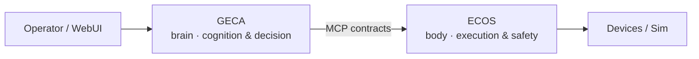

# 🏝️ Island-Team

**We build the robotic brain** — high-level control and decision systems for embodied agents.

*Let embodied agents come to life.* Dudulu~

---

## Who we are

Island-Team is an open-source dev crew with one obsession: giving robots a brain that actually works. Not another wrapper around a chat model — a full decision stack that understands orders, decomposes tasks, remembers what happened, and recovers when the world misbehaves.

Our answer is the **GECA–ECOS architecture**. GECA is the brain: cognition, planning, memory. ECOS is the body: execution, world state, real-time safety. They meet over versioned MCP capability contracts, so the brain never has to know what metal it's riding — the same agent drives a mock rig, a simulator, or a factory floor.

## Featured projects

**[Island-GECA](https://github.com/Island-Team/Island-GECA)** — the General Embodied Cognition Agent. Order understanding, task decomposition, state correlation, and recovery decisions, with every outbound action passing a safety gate. Python 3.12, MCP, asyncio; the agent model sits behind a Protocol seam, so Anthropic, OpenAI, or a local server are drop-in swaps.

**[Island-ECOS](https://github.com/Island-Team/Island-ECOS)** — the execution runtime. Owns the world model and a lock-free state service, orchestrates tasks, and enforces admission and real-time safety before anything reaches a device. C++17, Boost, JSON-RPC over WebSocket.

## What we work with

Agent models are the center of gravity: LLM/VLA fine-tuning, PyTorch, MCP tool ecosystems. Around them, hard engineering — Python and modern C++, async and lock-free runtimes, simulation-first development.

On robotics: we think ROS is a fine 2007 idea having a rough 2026. We're building a post-ROS, AI-native control stack instead of layering more abstraction on top of it.

## Find us

🏝️ [os-island.com](https://www.os-island.com/)
